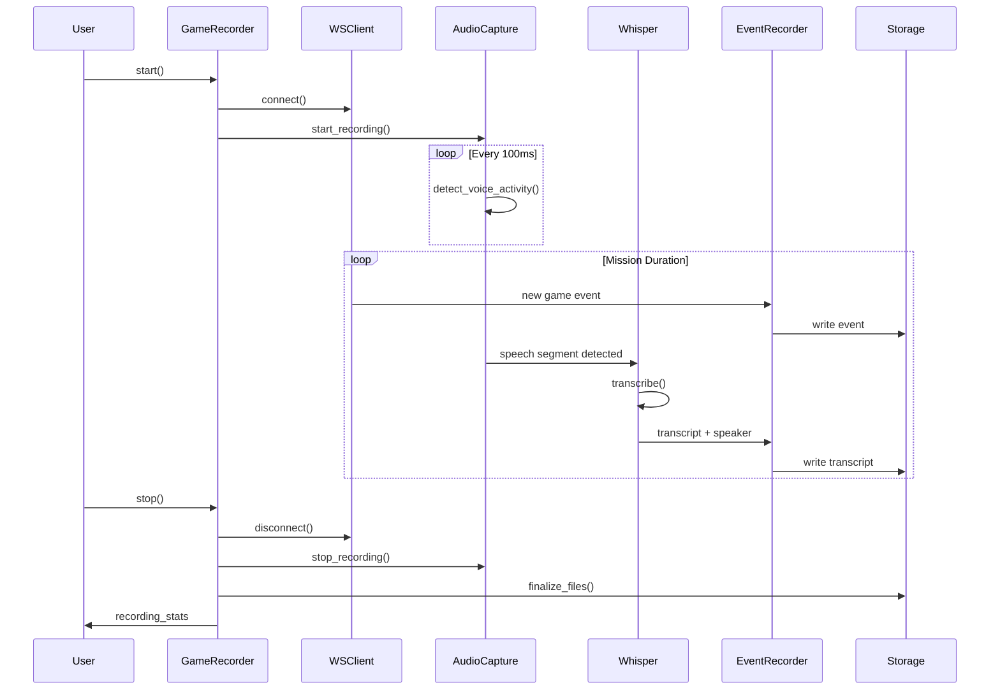

# Architecture Documentation

> **Last Updated**: 2025-10-15
>
> System architecture and design overview for Starship Horizons Learning AI.

## Table of Contents

- [System Overview](#system-overview)
- [Architecture Layers](#architecture-layers)
- [Data Flow](#data-flow)
- [Component Interactions](#component-interactions)
- [Technology Stack](#technology-stack)
- [Directory Structure](#directory-structure)
- [Design Patterns](#design-patterns)
- [Scalability Considerations](#scalability-considerations)

---

## System Overview

Starship Horizons Learning AI is a multi-layered telemetry capture and analysis system designed to record, process, and learn from bridge simulator missions.

### Core Capabilities

1. **Real-time Telemetry Capture** - WebSocket-based game state monitoring
2. **Audio Transcription** - AI-powered voice-to-text with speaker identification
3. **Event Recording** - Structured storage of game events and crew communications
4. **Mission Analysis** - Automated performance metrics and narrative generation
5. **LLM Integration** - Natural language report generation

### Design Philosophy

- **Modularity**: Each layer is independent and replaceable
- **Async-First**: All I/O operations are asynchronous
- **Configuration-Driven**: No hardcoded values, all settings via environment
- **Observable**: Comprehensive logging at all layers
- **Testable**: High test coverage with isolated unit tests

---

## Architecture Layers

```
┌─────────────────────────────────────────────────────────────┐
│                     Application Layer                        │
│  (Scripts, CLI tools, User-facing applications)             │
└────────────────────┬────────────────────────────────────────┘
                     │
┌────────────────────┴────────────────────────────────────────┐
│                      LLM Layer                               │
│  ┌──────────────┐  ┌──────────────┐  ┌──────────────┐      │
│  │   Ollama     │  │   Prompts    │  │   Stories    │      │
│  │   Client     │  │  Templates   │  │  Generator   │      │
│  └──────────────┘  └──────────────┘  └──────────────┘      │
└────────────────────┬────────────────────────────────────────┘
                     │
┌────────────────────┴────────────────────────────────────────┐
│                    Metrics Layer                             │
│  ┌──────────────┐  ┌──────────────┐  ┌──────────────┐      │
│  │    Event     │  │   Mission    │  │    Audio     │      │
│  │  Recorder    │  │ Summarizer   │  │ Transcript   │      │
│  └──────────────┘  └──────────────┘  └──────────────┘      │
└────────────────────┬────────────────────────────────────────┘
                     │
┌────────────────────┴────────────────────────────────────────┐
│                     Audio Layer                              │
│  ┌──────────────┐  ┌──────────────┐  ┌──────────────┐      │
│  │    Audio     │  │   Whisper    │  │   Speaker    │      │
│  │   Capture    │  │ Transcriber  │  │ Diarization  │      │
│  └──────────────┘  └──────────────┘  └──────────────┘      │
└────────────────────┬────────────────────────────────────────┘
                     │
┌────────────────────┴────────────────────────────────────────┐
│                  Integration Layer                           │
│  ┌──────────────┐  ┌──────────────┐  ┌──────────────┐      │
│  │     Game     │  │   Enhanced   │  │    Smart     │      │
│  │    Client    │  │    Client    │  │   Filters    │      │
│  └──────────────┘  └──────────────┘  └──────────────┘      │
└────────────────────┬────────────────────────────────────────┘
                     │
                     ▼
        ┌────────────────────────┐
        │  Starship Horizons     │
        │  Game Server           │
        │  (WebSocket/HTTP API)  │
        └────────────────────────┘
```

### Layer Descriptions

#### 1. Integration Layer (`src/integration/`)

**Purpose**: Connect to and communicate with Starship Horizons game server.

**Components**:
- `starship_horizons_client.py` - Base WebSocket client
- `enhanced_game_client.py` - Client with filtering and station handling
- `browser_mimic_websocket.py` - Browser-compatible WebSocket implementation
- `smart_filters.py` - Event filtering logic
- `station_handlers.py` - Station-specific event processing
- `game_recorder.py` - High-level recording orchestration

**Key Responsibilities**:
- WebSocket connection management
- Message serialization/deserialization
- Connection retry and error recovery
- Event filtering and routing

#### 2. Audio Layer (`src/audio/`)

**Purpose**: Capture and process audio from bridge crew communications.

**Components**:
- `capture.py` - Real-time audio capture with VAD
- `whisper_transcriber.py` - Speech-to-text using Faster-Whisper
- `speaker_diarization.py` - Speaker identification
- `neural_diarization.py` - Advanced neural speaker embeddings
- `config.py` - Audio system configuration

**Key Responsibilities**:
- Audio device management
- Voice Activity Detection (VAD)
- Speech transcription
- Speaker identification and tracking
- Engagement analytics

#### 3. Metrics Layer (`src/metrics/`)

**Purpose**: Record, aggregate, and analyze mission data.

**Components**:
- `event_recorder.py` - Event logging and persistence
- `mission_summarizer.py` - Mission analysis and reporting
- `audio_transcript.py` - Audio transcription management
- `learning_evaluator.py` - Performance evaluation

**Key Responsibilities**:
- Event storage and retrieval
- Timeline generation
- Performance metrics calculation
- Data export in multiple formats

#### 4. LLM Layer (`src/llm/`)

**Purpose**: Generate natural language summaries and narratives.

**Components**:
- `ollama_client.py` - Ollama API client
- `prompt_templates.py` - Structured prompts for analysis
- `story_prompts.py` - Narrative generation prompts
- `hybrid_prompts.py` - Combined factual + narrative prompts

**Key Responsibilities**:
- LLM server communication
- Prompt engineering
- Report generation in multiple styles
- Narrative storytelling

#### 5. Application Layer (`scripts/`, `examples/`)

**Purpose**: User-facing tools and utilities.

**Components**:
- Recording scripts (`record_*.py`)
- Test utilities (`test_*.py`)
- Report generators (`generate_*.py`)
- Audio utilities (`*_audio*.py`)

---

## Data Flow

### Recording Flow

```
┌──────────┐
│  User    │
│  Starts  │
│Recording │
└────┬─────┘
     │
     ▼
┌─────────────────┐
│  GameRecorder   │  ← Orchestrates recording session
└────┬───────┬────┘
     │       │
     │       └──────────────────────┐
     │                              │
     ▼                              ▼
┌──────────────┐           ┌─────────────────┐
│ WebSocket    │           │ AudioCapture    │
│ Client       │           │ Service         │
└──────┬───────┘           └────┬────────────┘
       │                        │
       │ Game Events            │ Audio Segments
       │                        │
       ▼                        ▼
┌──────────────┐           ┌─────────────────┐
│EventRecorder │           │   Whisper       │
│              │           │  Transcriber    │
└──────┬───────┘           └────┬────────────┘
       │                        │
       │ Timestamped            │ Transcripts +
       │ Events                 │ Speaker IDs
       │                        │
       └────────┬───────────────┘
                │
                ▼
         ┌──────────────┐
         │   Storage    │
         │              │
         │ - events.json│
         │ - trans.json │
         │ - timeline   │
         │ - audio/*.wav│
         └──────────────┘
```

### Analysis Flow

```
┌──────────┐
│  User    │
│Generates │
│ Report   │
└────┬─────┘
     │
     ▼
┌─────────────────┐
│MissionSummarizer│
└────┬────────────┘
     │
     │ Load Data
     ▼
┌─────────────────┐
│  Storage        │
│  - events.json  │
│  - trans.json   │
│  - timeline     │
└────┬────────────┘
     │
     ▼
┌─────────────────┐
│  Analysis       │
│  - Timeline     │
│  - Metrics      │
│  - Patterns     │
└────┬────────────┘
     │
     ▼
┌─────────────────┐
│  OllamaClient   │
│  (if enabled)   │
└────┬────────────┘
     │
     │ Generate
     │ Narrative
     ▼
┌─────────────────┐
│  Final Report   │
│  (.md file)     │
└─────────────────┘
```

---

## Component Interactions

### Scenario: Recording a Mission with Audio



---

## Technology Stack

### Core Technologies

| Component | Technology | Version | Purpose |
|-----------|-----------|---------|---------|
| Language | Python | 3.11+ | Primary development language |
| Async Framework | asyncio | Built-in | Asynchronous I/O |
| WebSocket | websockets | 12+ | Game server communication |
| Audio Capture | PyAudio | 0.2+ | Microphone input |
| Speech-to-Text | Faster-Whisper | 1.0+ | Transcription |
| Speaker ID | Pyannote.audio | 3.1+ | Neural diarization |
| LLM Client | Ollama | - | Local LLM inference |
| Testing | Pytest | 8+ | Unit and integration tests |
| Logging | Python logging | Built-in | Observability |

### External Dependencies

- **Starship Horizons Server** (required): Game server providing WebSocket API
- **Ollama Server** (optional): Local LLM for report generation
- **PulseAudio/ALSA** (Linux/WSL): Audio system support

### Data Formats

- **Events**: JSON with ISO 8601 timestamps
- **Transcripts**: JSON with speaker IDs and confidence scores
- **Audio**: WAV (16kHz mono float32)
- **Reports**: Markdown with frontmatter metadata

---

## Directory Structure

```
SH-Learning-AI/
├── src/                     # Production code
│   ├── integration/        # Game connection layer
│   ├── audio/             # Audio capture & processing
│   ├── metrics/           # Recording & analysis
│   └── llm/               # LLM integration
│
├── scripts/                # Standalone utilities
│   ├── record_*.py        # Recording scripts
│   ├── test_*.py          # Manual test scripts
│   └── generate_*.py      # Report generators
│
├── tests/                  # Test suite
│   ├── test_*.py          # Unit & integration tests
│   └── __init__.py
│
├── docs/                   # Documentation
│   ├── API.md             # API reference
│   ├── ARCHITECTURE.md    # This file
│   ├── QUICK_START.md     # Getting started
│   └── BEST_PRACTICES.md  # Development guidelines
│
├── data/                   # Runtime data (gitignored)
│   ├── game_recordings/   # Mission recordings
│   ├── models/            # AI model cache
│   └── sessions/          # Session data
│
├── templates/              # Code templates
│   ├── module_template.py
│   ├── script_template.py
│   └── test_template.py
│
├── .devcontainer/         # VS Code dev container
├── .env.example           # Environment template
└── requirements.txt       # Python dependencies
```

### File Naming Conventions

- **Modules**: `lowercase_with_underscores.py`
- **Classes**: `PascalCase`
- **Functions**: `snake_case`
- **Constants**: `UPPER_CASE`
- **Test files**: `test_<module>.py`
- **Scripts**: `<verb>_<noun>.py` (e.g., `record_game.py`)

---

## Design Patterns

### 1. Async Context Managers

Used for resource lifecycle management:

```python
class AudioCapture:
    async def __aenter__(self):
        await self.start()
        return self

    async def __aexit__(self, *args):
        await self.stop()

# Usage
async with AudioCapture() as capture:
    audio = await capture.get_segment()
```

### 2. Observer Pattern

Event-driven architecture for real-time processing:

```python
class GameRecorder:
    def __init__(self):
        self._event_handlers = []

    def add_handler(self, handler):
        self._event_handlers.append(handler)

    async def _process_event(self, event):
        for handler in self._event_handlers:
            await handler(event)
```

### 3. Strategy Pattern

Pluggable filtering and processing:

```python
class SmartFilter:
    def __init__(self, strategy: FilterStrategy):
        self.strategy = strategy

    def filter_events(self, events):
        return self.strategy.apply(events)
```

### 4. Factory Pattern

Configuration-driven component creation:

```python
class TranscriberFactory:
    @staticmethod
    def create(model_size: str):
        if model_size in ["tiny", "base", "small"]:
            return WhisperTranscriber(model_size)
        else:
            raise ValueError(f"Unknown model: {model_size}")
```

### 5. Dependency Injection

Loose coupling through constructor injection:

```python
class MissionSummarizer:
    def __init__(
        self,
        event_recorder: EventRecorder,
        llm_client: Optional[OllamaClient] = None
    ):
        self.events = event_recorder
        self.llm = llm_client or OllamaClient()
```

---

## Scalability Considerations

### Current Scale

- **Missions**: Up to 4 hours continuous recording
- **Events**: ~10,000 events per hour
- **Audio**: ~3600 segments per hour (1 per second during speech)
- **Storage**: ~500MB per hour (with audio)

### Performance Optimizations

1. **Async I/O**: Non-blocking operations prevent bottlenecks
2. **Queue-based Processing**: Audio segments processed asynchronously
3. **Smart Filtering**: Reduces event volume by 60-80%
4. **Lazy Loading**: Data loaded on-demand during analysis
5. **Streaming Transcription**: Real-time processing reduces memory

### Future Scalability

**For larger deployments**:

- **Database Backend**: Replace JSON with PostgreSQL/MongoDB
- **Message Queue**: Redis/RabbitMQ for event distribution
- **Distributed Processing**: Celery for background tasks
- **API Layer**: FastAPI for REST/GraphQL access
- **Containerization**: Docker for deployment consistency

**For multi-ship monitoring**:

- **Multi-tenant Architecture**: Separate recordings per ship
- **Load Balancing**: Multiple recorder instances
- **Centralized Storage**: S3/MinIO for recordings
- **Real-time Dashboard**: WebSocket-based monitoring UI

---

## Security Considerations

### Current Implementation

1. **No Authentication**: Assumes trusted local network
2. **No Encryption**: WebSocket over plain HTTP
3. **Local Storage**: All data stored locally
4. **Environment Variables**: Sensitive config in `.env` (gitignored)

### Production Recommendations

For production deployments:

1. **Use WSS (WebSocket Secure)** instead of WS
2. **Implement API Keys** for game server access
3. **Encrypt Recordings** at rest (e.g., age, gpg)
4. **Access Control** for stored recordings
5. **Rate Limiting** for LLM API calls
6. **Input Validation** on all external data

---

## Error Handling Strategy

### Levels of Recovery

1. **Retry**: Transient network errors (exponential backoff)
2. **Fallback**: Use default values or degraded mode
3. **Log and Continue**: Non-critical errors don't stop recording
4. **Graceful Shutdown**: Critical errors trigger cleanup

### Example

```python
async def connect_with_retry(max_retries=3):
    for attempt in range(max_retries):
        try:
            await client.connect()
            return True
        except ConnectionError as e:
            logger.warning(f"Attempt {attempt+1} failed: {e}")
            if attempt < max_retries - 1:
                await asyncio.sleep(2 ** attempt)  # Exponential backoff
            else:
                logger.error("Max retries exceeded")
                raise
```

---

## Testing Strategy

### Test Pyramid

```
       ┌─────────────┐
       │     E2E     │  ← Few (complete workflows)
       │   Tests     │
       ├─────────────┤
       │Integration  │  ← Some (component interactions)
       │   Tests     │
       ├─────────────┤
       │    Unit     │  ← Many (isolated functions)
       │   Tests     │
       └─────────────┘
```

### Test Categories

1. **Unit Tests** (`tests/test_*.py`)
   - Mock external dependencies
   - Fast execution (<1s per test)
   - High coverage (>80%)

2. **Integration Tests** (`tests/test_*_integration.py`)
   - Test component interactions
   - Use real Whisper models (cached)
   - Moderate speed (1-10s per test)

3. **Manual Tests** (`scripts/test_*_manual.py`)
   - Require game server running
   - Interactive validation
   - Used for development

### Mocking Strategy

```python
@patch('src.audio.capture.pyaudio.PyAudio')
def test_audio_capture(mock_pyaudio):
    mock_stream = Mock()
    mock_pyaudio.return_value.open.return_value = mock_stream

    capture = AudioCapture()
    # Test without real audio device
```

---

## Configuration Management

### Environment Variables

All configuration via `.env` file:

```bash
# Required
GAME_HOST=192.168.68.55

# Optional with defaults
AUDIO_SAMPLE_RATE=16000
WHISPER_MODEL_SIZE=base
ENABLE_LLM_REPORTS=true
```

### Configuration Hierarchy

1. **Environment Variables** (highest priority)
2. **`.env` File**
3. **Code Defaults** (fallback)

### Validation

```python
def validate_config():
    host = os.getenv('GAME_HOST')
    if not host:
        raise ValueError("GAME_HOST must be set")

    sample_rate = int(os.getenv('AUDIO_SAMPLE_RATE', '16000'))
    if sample_rate not in [8000, 16000, 44100, 48000]:
        logger.warning(f"Unusual sample rate: {sample_rate}")
```

---

## Logging and Observability

### Log Levels

- **DEBUG**: Detailed diagnostic info (verbose)
- **INFO**: Confirmation of normal operation
- **WARNING**: Something unexpected but handled
- **ERROR**: Serious issue, functionality impaired
- **CRITICAL**: System cannot continue

### Log Format

```
2025-10-15 14:23:45,123 - module_name - INFO - Message here
```

### Structured Logging

```python
logger.info(
    "Recording started",
    extra={
        "session_id": session_id,
        "host": host,
        "audio_enabled": audio_enabled
    }
)
```

---

## Future Architecture

### Planned Enhancements

1. **AI Crew Members** (`src/agents/`)
   - Real-time decision making
   - Voice synthesis responses
   - Multi-agent coordination

2. **MCP Server Integration** (`src/mcp_servers/`)
   - Model Context Protocol support
   - External tool integration

3. **Voice Control** (`src/voice/`)
   - Natural language commands
   - Intent recognition

4. **Web Dashboard**
   - Real-time monitoring
   - Historical mission browser
   - Crew performance analytics

---

## References

- [API Documentation](API.md) - Detailed API reference
- [Quick Start Guide](QUICK_START.md) - Getting started
- [Best Practices](BEST_PRACTICES.md) - Development guidelines
- [CLAUDE.md](../CLAUDE.md) - Mandatory coding standards

---

**Document Version**: 1.0
**Last Reviewed**: 2025-10-15
**Next Review**: When major architectural changes occur
